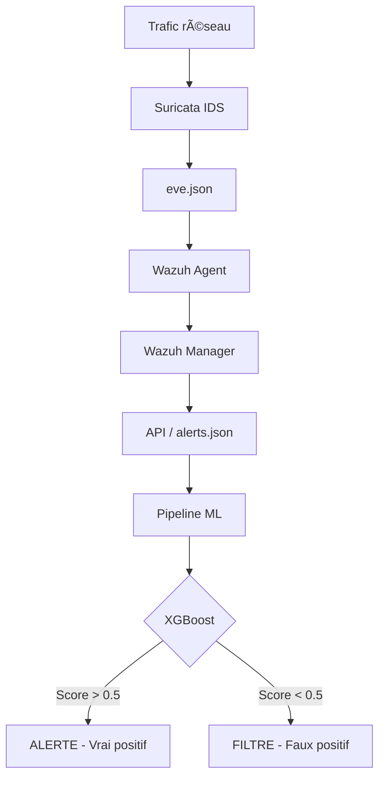
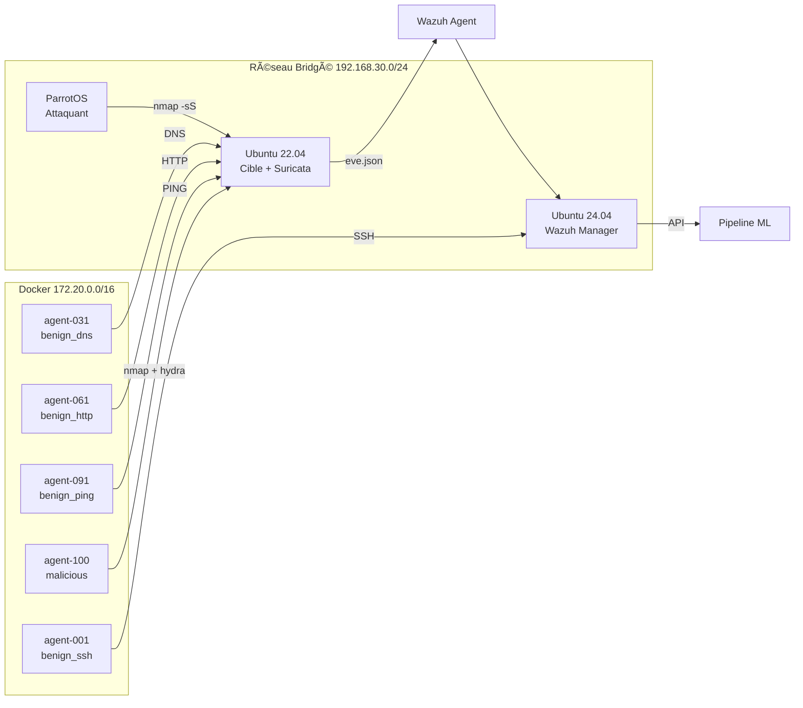

# Wazuh AI Filter 🔧

Filtre intelligent pour alertes Wazuh basé sur le Machine Learning.  
Distingue les **vrais positifs** (attaques réelles) des **faux positifs** (trafic normal qui déclenche une alerte).

## Problème

Wazuh détecte des milliers d'alertes par jour. L'analyste passe 80% de son temps à trier les faux positifs.

## Solution

Un modèle XGBoost entraîné **sur votre propre réseau**, qui apprend les motifs de vos attaques réelles et filtre le bruit automatiquement.



## Architecture du labo



## Pipeline

```mermaid
graph LR
    C[Campagne Docker] --> CSV[attack_campaigns.csv]
    CSV --> L[02_label_dataset.py]
    A1[01_collect_alerts.py] --> L
    L --> D[Dataset labellisé]
    D --> F[03_feature_engineering.py]
    F --> M[04_train_model.py]
    M --> E[05_evaluate_model.py]
    E --> R[Modèle final]\nreports/
```

## Installation rapide

```bash
git clone https://github.com/maraa081/wazuh-test.git
cd wazuh-test
python3 -m venv .venv
source .venv/bin/activate
pip install -r requirements.txt
```

## Structure

```
wazuh-test/
├── config/                    # Configuration (Wazuh, features, model)
├── pipeline/                  # 5 étapes du pipeline ML
│   ├── 01_collect_alerts.py   # Collecte des alertes Wazuh
│   ├── 02_label_dataset.py    # Labelisation via campagnes
│   ├── 03_feature_engineering.py # Calcul des features
│   ├── 04_train_model.py      # Entraînement XGBoost
│   └── 05_evaluate_model.py   # Évaluation + SHAP
├── data/                      # Données (gitignored)
│   ├── attack_windows/        # CSV des campagnes d'attaque
│   ├── raw_alerts/            # Alertes brutes JSONL
│   └── labeled/               # Datasets labellisés
├── service/                   # Service d'inférence
├── scripts/                   # Scripts utilitaires
│   ├── docker-dataset/        # Génération de dataset massif
│   └── campaign-runner.sh     # Génération d'attaques
├── docs/                      # Documentation
├── features/                  # Matrices de features (gitignored)
├── models/                    # Modèles entraînés (gitignored)
└── reports/                   # Rapports d'évaluation (gitignored)
```

## Licence

MIT
