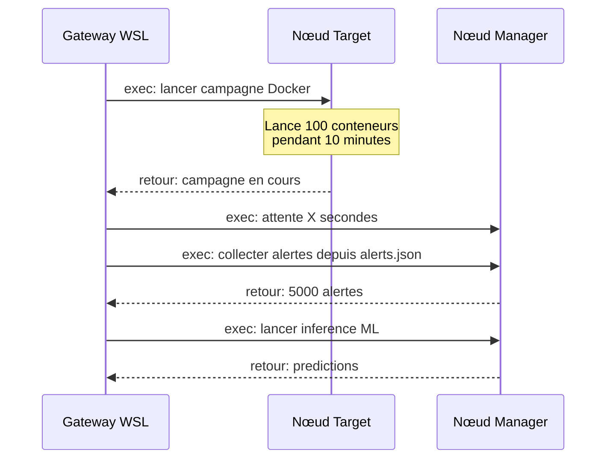

# Déploiement des nœuds OpenClaw sur le labo Wazuh

## Architecture cible

```
┌─────────────────────────────────────────────────────────────┐
│                    WSL (Windows)                             │
│  OpenClaw Gateway Principal                                  │
│  172.31.240.191:18789                                        │
│  Rôle : orchestrateur central                                │
│  Domaines : guaiguai2.duckdns.org                            │
│  Reverse proxy : Caddy (ports 80/443)                        │
├─────────────────────────────────────────────────────────────┤
                              │
         ┌────────────────────┼────────────────────┐
         │ WebSocket          │ WebSocket           │
         ▼                    ▼                     ▼
┌──────────────────┐  ┌──────────────────┐  ┌──────────────────┐
│  Manager VM       │  │  Target VM        │  │  (Futur)         │
│  192.168.30.3     │  │  192.168.30.10    │  │  ParrotOS        │
│  Ubuntu 24.04     │  │  Ubuntu 22.04     │  │  192.168.30.x    │
│  ─ Nœud OpenClaw  │  │  ─ Nœud OpenClaw  │  │                  │
│  ─ Wazuh Manager  │  │  ─ Suricata       │  │                  │
│  ─ ML Sidecar     │  │  ─ Docker         │  │                  │
│  ─ API :9090      │  │  ─ Wazuh Agent    │  │                  │
└──────────────────┘  └──────────────────┘  └──────────────────┘

           │                    │
           └────────────────────┘
              Communication directe
              (réseau Host-Only 192.168.30.0/24)
```

## Principe de fonctionnement

Chaque VM exécute un **nœud OpenClaw** (headless node host) qui se connecte
au Gateway principal (WSL) via WebSocket. Une fois connecté, le Gateway peut
exécuter des commandes directement sur la VM via `exec` avec `host=node`.

Les nœuds sont aussi accessibles via `openclaw nodes invoke`.

## Connectivité réseau

### Problème
- WSL : 172.31.240.x (NAT VMware/WSL)
- VMs : 192.168.30.x (Host-Only VirtualBox)
- **Pas de routage direct entre les deux réseaux**

### Solution : Portproxy Windows (recommandée)

Le Windows hôte a une interface Host-Only (192.168.30.1). On configure un
portproxy pour que les VMs atteignent WSL via cette IP :

```powershell
# PowerShell (Admin) sur Windows
netsh interface portproxy add v4tov4 `
  listenport=18789 listenaddress=0.0.0.0 `
  connectaddress=172.31.240.191 connectport=18789

# Vérifier
netsh interface portproxy show all
```

Les VMs se connectent ensuite à `ws://192.168.30.1:18789`.

**⚠️ Attention** : L'IP WSL change au reboot Windows. Après reboot :
1. Dans WSL : `ip addr show eth0 | grep inet`
2. Mettre à jour le portproxy : `netsh interface portproxy set v4tov4 ...`

### Alternative : Via DuckDNS (si les VMs ont accès Internet)

Si les VMs ont une interface NAT en plus du Host-Only, elles peuvent utiliser
le domaine externe :

```bash
openclaw node run --host guaiguai2.duckdns.org --port 443 --tls
```

**Avantage** : pas de config Windows.
**Inconvénient** : nécessite internet, latence plus élevée.

### Alternative 2 : Tunnel SSH

Si aucune des solutions ci-dessus n'est possible, on peut tunneliser :

```bash
# Sur Windows, créer un tunnel SSH reverse depuis la VM
ssh -R 18789:localhost:18789 vboxuser@192.168.30.3
```

---

## 1. Manager VM (Ubuntu 24.04 — 192.168.30.3)

### 1.1 Inventaire existant

| Composant | Statut | Détail |
|-----------|--------|--------|
| Wazuh Manager | Installe | All-in-One (indexeur + dashboard + manager) |
| OpenSearch | Installe | Port 9200 |
| Wazuh API | Installe | Port 55000 (credentials dans /home/vboxuser/wazuh-install-files.tar) |
| Python 3 | Installe | Ubuntu 24.04 fournit python3 |
| pip3 | A installer | `sudo apt install python3-pip -y` |
| XGBoost | A installer | `pip3 install xgboost --break-system-packages --ignore-installed typing-extensions` |
| SQLite3 | Installe | Utilise par le sidecar ML |
| ML Sidecar (inference) | A deployer | inference_service.py + api_service.py |
| API ML | A deployer | Port 9090 |
| OpenClaw node | A installer | Ce document |

### 1.2 Installation d'OpenClaw

#### Étape 1 : Installer OpenClaw

```bash
# Se connecter à la VM Manager
ssh vboxuser@192.168.30.3

# Installer OpenClaw
curl -sL https://openclaw.ai/install.sh | bash

# Vérifier
openclaw --version
```

#### Étape 2 : Configurer la connexion au Gateway

Le nœud a besoin du token/password du Gateway. Méthode recommandée :

```bash
# Solution A : avec token Gateway
# Le token est stocké dans la config du Gateway principal
# Sur le Gateway WSL :
cat ~/.openclaw/openclaw.json | grep -A5 '"auth"'

# Solution B : avec un token dédié (créer si pas de token)
# Sur le Gateway WSL, créer un token :
```

Configurer le nœud :

```bash
# Sur la VM Manager
export OPENCLAW_GATEWAY_TOKEN="token_du_gateway"
# Ou utiliser le password :
export OPENCLAW_GATEWAY_PASSWORD="mot_de_passe"

# Lancer le nœud (foreground pour test)
openclaw node run --host 192.168.30.1 --port 18789 --display-name "manager-wazuh"
```

#### Étape 3 : Approuver le nœud sur le Gateway

```bash
# Sur le Gateway WSL
openclaw nodes list
openclaw nodes pending
openclaw nodes approve <requestId>
```

#### Étape 4 : Installer le service systemd

```bash
# Sur la VM Manager, arrêter d'abord le run foreground, puis :
openclaw node install \
  --host 192.168.30.1 \
  --port 18789 \
  --display-name "manager-wazuh"

openclaw node start
openclaw node status
```

**Note** : `openclaw node install` lit les credentials depuis l'environnement.
Vérifier qu'`OPENCLAW_GATEWAY_TOKEN` était défini pendant l'installation,
sinon il faut les passer via le fichier `~/.openclaw/node.json`.

Si besoin, éditer manuellement `~/.openclaw/node.json` :

```json
{
  "id": "manager-wazuh",
  "token": "...",
  "gatewayUrl": "ws://192.168.30.1:18789"
}
```

#### Étape 5 : Installer les dépendances ML si pas déjà fait

```bash
sudo apt install python3-pip sqlite3 -y
sudo pip3 install xgboost --break-system-packages --ignore-installed typing-extensions
pip3 install fastapi uvicorn --break-system-packages
```

#### Étape 6 : Déployer le ML Sidecar

```bash
# Cloner le repo (ou copier depuis le Gateway)
git clone https://github.com/maraa081/wazuh-test.git /home/vboxuser/wazuh-test

# Copier les fichiers du sidecar
sudo cp /home/vboxuser/wazuh-test/scripts/inference_service.py /opt/wazuh-ml/
sudo cp /home/vboxuser/wazuh-test/scripts/api_service.py /opt/wazuh-ml/
sudo cp /home/vboxuser/wazuh-test/models/xgb_model.json /opt/wazuh-ml/
sudo cp /home/vboxuser/wazuh-test/models/xgb_model_metrics.json /opt/wazuh-ml/

# Permission d'écriture pour la DB
sudo touch /tmp/predictions.db
sudo chmod 666 /tmp/predictions.db
sudo chmod 755 /opt/wazuh-ml/*.py

# Créer les services systemd (voir service/)
sudo cp /home/vboxuser/wazuh-test/service/*.service /etc/systemd/system/
sudo systemctl daemon-reload
sudo systemctl enable wazuh-inference wazuh-api
sudo systemctl start wazuh-inference wazuh-api
```

### 1.3 Fichiers et services critiques

| Chemin | Description |
|--------|-------------|
| `/var/ossec/logs/alerts/alerts.json` | Flux d'alertes Wazuh (lecture) |
| `/opt/wazuh-ml/inference_service.py` | Service d'inference XGBoost |
| `/opt/wazuh-ml/api_service.py` | API REST FastAPI (port 9090) |
| `/opt/wazuh-ml/xgb_model.json` | Modele entraine XGBoost |
| `/opt/wazuh-ml/xgb_model_metrics.json` | Metriques + feature names |
| `/tmp/predictions.db` | Base SQLite des predictions |
| `/etc/systemd/system/wazuh-inference.service` | Service inference |
| `/etc/systemd/system/wazuh-api.service` | Service API |
| `~/.openclaw/node.json` | Config du nœud OpenClaw |
| `/etc/systemd/system/openclaw-node.service` | Service OpenClaw node |

### 1.4 Ports exposes

| Port | Service | Accessible depuis |
|------|---------|-------------------|
| 22 | SSH | 192.168.30.0/24 |
| 55000 | Wazuh API | 192.168.30.0/24 |
| 9200 | OpenSearch | localhost |
| 9090 | API ML sidecar | 192.168.30.0/24 |
| - | OpenClaw node (outbound) | ws://192.168.30.1:18789 |

### 1.5 Dependances

```bash
# System
sudo apt install -y python3 python3-pip sqlite3 git curl

# Python (ML)
pip3 install xgboost fastapi uvicorn --break-system-packages

# Comportement du nœud : ecoute les commandes du Gateway
# Pas besoin de ports entrant pour OpenClaw (WebSocket sortant)
```

---

## 2. Target VM (Ubuntu 22.04 — 192.168.30.10)

### 2.1 Inventaire existant

| Composant | Statut | Détail |
|-----------|--------|--------|
| Wazuh Agent | Installe | Connecte au Manager 192.168.30.3 |
| Suricata | Installe | OISF repo, regles ET (51968 regles) |
| Suricata config | Configuree | enp0s8, HOME_NET=192.168.30.0/24 |
| Regles custom | Configurees | /var/lib/suricata/rules/local.rules |
| Docker | Installe | Pour les campagnes |
| Scripts campagne | A deployer | traffic-generator/ |
| Python 3 | Installe | Ubuntu 22.04 fournit python3 |
| OpenClaw node | A installer | Ce document |

### 2.2 Installation d'OpenClaw

#### Étape 1 : Installer OpenClaw

```bash
# Sur la VM Target
ssh vboxuser@192.168.30.10

curl -sL https://openclaw.ai/install.sh | bash
openclaw --version
```

#### Étape 2 : Lancer le nœud (test)

```bash
export OPENCLAW_GATEWAY_TOKEN="token_du_gateway"
openclaw node run --host 192.168.30.1 --port 18789 --display-name "target-suricata"
```

#### Étape 3 : Approuver (depuis Gateway WSL)

```bash
openclaw nodes approve <requestId>
```

#### Étape 4 : Installer le service

```bash
openclaw node install \
  --host 192.168.30.1 \
  --port 18789 \
  --display-name "target-suricata"

openclaw node start
openclaw node status
```

### 2.3 Fichiers et services critiques

| Chemin | Description |
|--------|-------------|
| `/etc/suricata/suricata.yaml` | Configuration Suricata |
| `/var/lib/suricata/rules/local.rules` | Regles custom scan Nmap |
| `/var/log/suricata/eve.json` | Flux d'alertes Suricata |
| `/var/log/suricata/fast.log` | Log rapide Suricata |
| `/var/ossec/etc/ossec.conf` | Config Wazuh Agent |
| `/home/vboxuser/wazuh-test/traffic-generator/` | Scripts campagne Docker |
| `~/.openclaw/node.json` | Config du nœud OpenClaw |
| `/etc/systemd/system/openclaw-node.service` | Service OpenClaw node |

### 2.4 Ports exposes

| Port | Service | Accessible depuis |
|------|---------|-------------------|
| 22 | SSH | 192.168.30.0/24 |
| - | Suricata (passif) | ecoute enp0s8 |
| - | Docker (bridge) | reseau interne |
| - | OpenClaw node (outbound) | ws://192.168.30.1:18789 |

### 2.5 Dependances

```bash
# Deja installe
sudo apt install -y suricata docker.io docker-compose git
# Verification Suricata
sudo suricata -T -c /etc/suricata/suricata.yaml
# Verification Docker
sudo docker ps
```

---

## 3. Communication entre agents

### 3.1 Principe

```
Gateway WSL
  │
  ├── exec host=node "manager-wazuh"  → commande sur Manager
  ├── exec host=node "target-suricata" → commande sur Target
  └── sessions_spawn                   → tâche isolée avec accès aux nœuds
```

### 3.2 Utilisation depuis le Gateway

Une fois les nœuds connectés et approuvés, on peut :

#### Exécuter une commande sur un nœud spécifique

```bash
# Lister les nœuds disponibles
openclaw nodes list
openclaw nodes list --connected

# Voir le statut
openclaw nodes status

# Exécuter une commande simple
openclaw nodes invoke --node "manager-wazuh" \
  --command "system.run" \
  --params '{"command": "systemctl status wazuh-inference"}'

# Exécuter via le Gateway (mode exec)
# Depuis le chat OpenClaw/WSL :
# → exec(host=node, node="manager-wazuh", command="systemctl restart wazuh-api")
```

#### Agent-to-agent via Gateway

Le Gateway orchestre les interactions. Exemple : déclencher une campagne
d'attaque sur la Target, puis collecter les alertes sur le Manager :



### 3.3 Fallback : communication directe entre VMs

Si le Gateway n'est pas disponible, les VMs peuvent communiquer directement
via SSH ou API REST (elles sont sur le même réseau 192.168.30.0/24) :

```bash
# De la Target vers le Manager (SSH)
ssh vboxuser@192.168.30.3 "systemctl status wazuh-inference"

# API REST directe (Manager → API ML)
curl -s http://192.168.30.3:9090/predictions/recent

# De la Target vers le Manager (Wazuh API)
curl -s -u wazuh-wui:tpuKUfY7Auj2kd9yeRBwgiNjHH+mmNso \
  http://192.168.30.3:55000/security/alerts
```

### 3.4 Scripts d'automatisation côté Gateway

Une fois les nœuds en place, on peut écrire des scripts qui orchestrent
les deux VMs depuis WSL :

```bash
#!/bin/bash
# Exemple : campagne_et_inference.sh
# Déclenché depuis le Gateway WSL

NODE_TARGET="target-suricata"
NODE_MANAGER="manager-wazuh"

echo "[1/3] Lancement de la campagne sur la Target..."
openclaw nodes invoke --node "$NODE_TARGET" \
  --command "system.run" \
  --params '{"command": "cd /home/vboxuser/wazuh-test/traffic-generator && sudo python3 main.py --duration 600"}'

echo "[2/3] Attente de la campagne..."
sleep 60

echo "[3/3] Collecte + inference sur le Manager..."
openclaw nodes invoke --node "$NODE_MANAGER" \
  --command "system.run" \
  --params '{"command": "cd /opt/wazuh-ml && python3 inference_service.py --collect-only"}'
```

---

## 4. Procédure complète de bout en bout

### 4.1 Sur Windows (une seule fois)

```powershell
# PowerShell (Admin)
netsh interface portproxy add v4tov4 `
  listenport=18789 listenaddress=0.0.0.0 `
  connectaddress=172.31.240.191 connectport=18789
netsh interface portproxy show all

# Optionnel : firewall rule
netsh advfirewall firewall add rule name="OpenClaw-Node" `
  dir=in action=allow protocol=TCP localport=18789
```

### 4.2 Sur le Gateway WSL (une seule fois)

```bash
# Récupérer le token Gateway
grep -A5 '"auth"' ~/.openclaw/openclaw.json

# (Optionnel) Configurer l'auto-approve des nœuds du labo
# Ajouter dans openclaw.json :
#   "gateway": {
#     "nodes": {
#       "pairing": {
#         "autoApproveCidrs": ["192.168.30.0/24"]
#       }
#     }
#   }

# Redémarrer le Gateway
openclaw gateway restart
```

### 4.3 Sur le Manager VM

```bash
# 1. Installer OpenClaw
curl -sL https://openclaw.ai/install.sh | bash

# 2. Installer le nœud avec les bons paramètres
export OPENCLAW_GATEWAY_TOKEN="<token>"
openclaw node install \
  --host 192.168.30.1 \
  --port 18789 \
  --display-name "manager-wazuh"
openclaw node start

# 3. Vérifier
openclaw node status
```

### 4.4 Sur la Target VM

```bash
# 1. Installer OpenClaw
curl -sL https://openclaw.ai/install.sh | bash

# 2. Installer le nœud
export OPENCLAW_GATEWAY_TOKEN="<token>"
openclaw node install \
  --host 192.168.30.1 \
  --port 18789 \
  --display-name "target-suricata"
openclaw node start
```

### 4.5 Sur le Gateway WSL (vérification)

```bash
# Voir les nœuds
openclaw nodes list

# Tester le Manager
openclaw nodes invoke --node "manager-wazuh" \
  --command "system.run" \
  --params '{"command": "uptime"}'

# Tester la Target
openclaw nodes invoke --node "target-suricata" \
  --command "system.run" \
  --params '{"command": "sudo suricata -T -c /etc/suricata/suricata.yaml"}'
```

---

## 5. Dépannage

### 5.1 Le nœud ne se connecte pas

Symptôme : `openclaw node run` échoue avec timeout ou connexion refusée.

**Causes possibles :**

1. **Portproxy pas configuré**
   → Vérifier sur Windows : `netsh interface portproxy show all`
   → Tester depuis la VM : `curl -v http://192.168.30.1:18789` (devrait répondre)

2. **IP WSL changée (reboot Windows)**
   → Dans WSL : `ip addr show eth0 | grep inet`
   → PowerShell Admin : `netsh interface portproxy set v4tov4 ...`

3. **Firewall Windows bloque le port**
   → `netsh advfirewall firewall show rule name="OpenClaw-Node"`

4. **Pas de route entre les VMs et Windows (Host-Only)**
   → Vérifier que les VMs peuvent pinger 192.168.30.1

### 5.2 Approbation du nœud

Si le nœud reste en statut "pending" :

```bash
# Lister les requêtes en attente
openclaw nodes list
# ou
openclaw nodes pending

# Approuver
openclaw nodes approve <requestId>
```

### 5.3 Connexion WebSocket sécurisée

Si le Gateway est configuré avec TLS, utiliser `--tls` :

```bash
openclaw node run --host guaiguai2.duckdns.org --port 443 --tls
```

### 5.4 Redémarrage après reboot

Les services systemd redémarrent automatiquement les nœuds.
Vérifier :

```bash
systemctl status openclaw-node
```

Si le nœud ne se reconnecte pas après un reboot du Gateway :

```bash
# Redémarrer le service nœud
sudo systemctl restart openclaw-node

# Voir les logs
journalctl -u openclaw-node -n 50 --no-pager
```

---

## 6. Checklist de validation

### Manager VM
- [ ] OpenClaw installé (`openclaw --version`)
- [ ] Nœud connecté au Gateway (`openclaw node status` → connected)
- [ ] Nœud approuvé sur le Gateway WSL
- [ ] test : `openclaw nodes invoke --node "manager-wazuh" --command "system.run" --params '{"command":"uptime"}'`
- [ ] ML Sidecar OK (`curl http://192.168.30.3:9090/predictions/recent`)
- [ ] Dépendances Python installées
- [ ] Service systemd installé et enabled

### Target VM
- [ ] OpenClaw installé (`openclaw --version`)
- [ ] Nœud connecté au Gateway (`openclaw node status` → connected)
- [ ] Nœud approuvé sur le Gateway WSL
- [ ] test : `openclaw nodes invoke --node "target-suricata" --command "system.run" --params '{"command":"uptime"}'`
- [ ] Suricata fonctionnel (`sudo suricata -T -c /etc/suricata/suricata.yaml`)
- [ ] Docker fonctionnel (`sudo docker ps`)
- [ ] Campagne exécutable (`cd /home/vboxuser/wazuh-test/traffic-generator && sudo python3 main.py --dry-run`)

### Communication
- [ ] Gateway WSL → Manager : exec OK
- [ ] Gateway WSL → Target : exec OK
- [ ] Manager → Target : ping 192.168.30.10 OK (SSH)
- [ ] Target → Manager : ping 192.168.30.3 OK (SSH)
- [ ] API ML accessible depuis la Target
- [ ] Portproxy Windows persiste après reboot

---

## 7. Schéma final : tout l'écosystème

```
┌──────────────────────────────────────────────────────────────────────┐
│                        WSL (OpenClaw Gateway)                         │
│                                                                       │
│   ┌────────────────┐  ┌──────────────────┐  ┌──────────────┐         │
│   │   main.py       │  │  campagne.sh     │  │  pipeline/   │         │
│   │  (orchestrateur)│  │  (auto-attaque)   │  │  ML complet  │         │
│   └────────────────┘  └──────────────────┘  └──────────────┘         │
│            │                       │                  │              │
│            ▼                       ▼                  ▼              │
│      exec(host=node,         exec(host=node,    exec(host=node,      │
│      node="manager")         node="target")     node="manager")      │
│                                                                       │
└──────────────────────────────────────────────────────────────────────┘
         │                        │
         │ ws://192.168.30.1      │ ws://192.168.30.1
         ▼                        ▼
┌──────────────────┐    ┌──────────────────┐    ┌──────────────────┐
│  Manager VM       │    │  Target VM        │    │  Windows Host    │
│  192.168.30.3     │    │  192.168.30.10    │    │  (Portproxy)     │
│                   │    │                   │    │  192.168.30.1    │
│  ┌─────────────┐  │    │  ┌─────────────┐  │    │                   │
│  │OpenClaw Node│  │    │  │OpenClaw Node│  │    │  netsh:           │
│  │(agent)      │  │    │  │(agent)      │  │    │  0.0.0.0:18789    │
│  └─────────────┘  │    │  └─────────────┘  │    │  → 172.31.240.191 │
│                   │    │                   │    │  :18789           │
│  ┌─────────────┐  │    │  ┌─────────────┐  │    └──────────────────┘
│  │Wazuh Manager│  │    │  │Suricata     │  │
│  │(all-in-one) │  │    │  │(IDS)        │  │
│  └─────────────┘  │    │  └─────────────┘  │
│                   │    │                   │
│  ┌─────────────┐  │    │  ┌─────────────┐  │
│  │ML Inference │  │    │  │Docker       │  │
│  │API :9090    │  │    │  │(campagnes)  │  │
│  └─────────────┘  │    │  └─────────────┘  │
│                   │    │                   │
│  ┌─────────────┐  │    │  ┌─────────────┐  │
│  │OpenSearch   │  │    │  │Wazuh Agent  │  │
│  │:9200        │  │    │  │(ossec)      │  │
│  └─────────────┘  │    │  └─────────────┘  │
└──────────────────┘    └──────────────────┘
```

---

## Références

- [OpenClaw docs — Node host](/cli/node)
- [OpenClaw docs — Nodes management](/cli/nodes)
- [OpenClaw docs — Multi-agent routing](/concepts/multi-agent)
- [OpenClaw docs — Gateway configuration](/gateway/configuration)
- [Voir aussi] PLAN_AGENTS_OPENCLAW.md — plan conceptuel original
- [Voir aussi] JOURNAL_DE_BORD.md — historique des problèmes résolus
- [Voir aussi] DEVELOPMENT_CHARTER.md — charte de dev MLOps
- [Voir aussi] DEPLOYMENT_NOTES.md — notes déploiement Suricata
