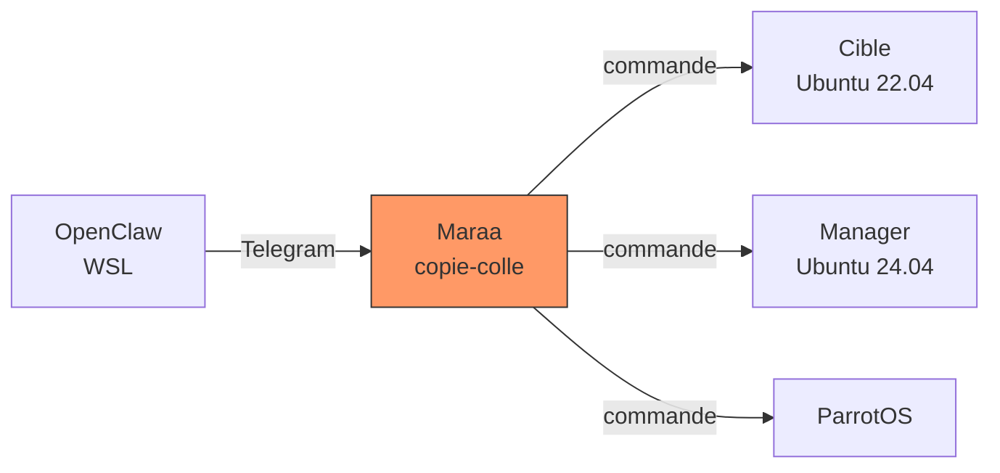
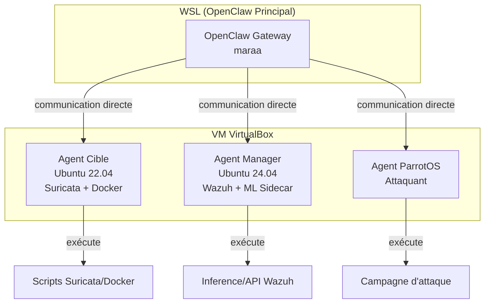

# Plan — Déploiement d'agents OpenClaw sur les VMs du labo

## Constat

Aujourd'hui, toute la configuration s'est faite par copier-coller de commandes
entre Telegram et les VMs. L'utilisateur (Maraa) jouait le rôle d'« interpréteur
humain » entre OpenClaw (WSL) et les machines VirtualBox :



**Problème :** L'utilisateur passe son temps à copier-coller, les allers-retours
sont lents, et les erreurs de copie sont fréquentes (syntaxe, mauvaises VM).

## Solution : Agents OpenClaw sur chaque VM

Installer OpenClaw en mode **agent** sur chaque VM du labo. Ces agents
reçoivent des instructions directement depuis la session principale (WSL)
et exécutent les commandes sans intervention humaine.



## Pourquoi c'est mieux

| Avant (sans agent) | Après (avec agent) |
|-------------------|-------------------|
| Maraa copie-colle chaque commande | OpenClaw exécute directement |
| 10 allers-retours pour un fix | 1 instruction = exécution immédiate |
| Erreurs de copie fréquentes | Zéro erreur de syntaxe |
| L'utilisateur regarde chaque output | Les logs remontent automatiquement |
| 1 seul écran de terminal à la fois | Plusieurs VMs en parallèle |

## Comment ça marche

OpenClaw en mode agent fonctionne comme un nœud esclave :

1. Sur chaque VM, installer le service OpenClaw (`openclaw node`)
2. Le nœud se connecte au Gateway principal (WSL)
3. Le Gateway peut envoyer des tâches à exécuter sur le nœud
4. Les résultats remontent automatiquement

```bash
# Installation d'un agent (exemple)
curl -sL https://openclaw.ai/install.sh | bash
openclaw node install
openclaw node connect wss://172.31.240.191:18789 --token <token>
```

## Prochaine étape

Installer les agents sur :
1. **Manager** (Ubuntu 24.04) — prioritaire, ML sidecar + API
2. **Cible** (Ubuntu 22.04) — Suricata + Docker dataset
3. **ParrotOS** — attaques automatisées

Une fois les agents déployés, on peut :
- Lancer des campagnes d'attaque depuis une commande unique
- Redémarrer les services à distance sans copier-coller
- Debugguer en temps réel sans changer de terminal
- Automatiser le pipeline ML complet

## Prérequis

- Port 18789 accessible depuis les VMs vers le WSL
- Token d'authentification OpenClaw
- OpenClaw installé sur chaque VM (Linux supporté)
- Service systemd pour la persistance au reboot
