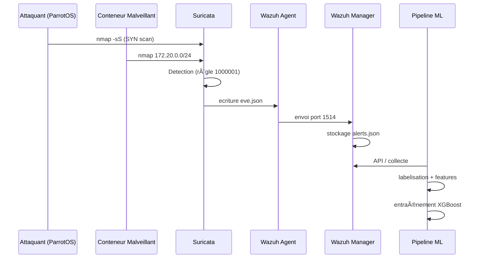

# Architecture du projet

## Vue d'ensemble

```mermaid
graph TB
    subgraph "Labo VirtualBox"
        subgraph "Hôte Windows"
            WSL[WSL2 - OpenClaw\nDéveloppement]
        end
        
        subgraph "VM Ubuntu 24.04 — Manager Wazuh"
            WM[Wazuh Manager\nport 1514]
            WA[Wazuh API\nport 55000]
            AJ[alerts.json]
        end
        
        subgraph "VM Ubuntu 22.04 — Cible + Suricata"
            SUR[Suricata 8.0.6]
            WAG[Wazuh Agent]
            DOCK[Docker Engine]
            
            subgraph "Conteneurs 172.20.0.0/16"
                B1[Bénins × 99\nSSH/DNS/HTTP/Ping]
                M1[Malveillant × 1\nnmap + hydra]
            end
            
            SUR -->|eve.json| WAG
            DOCK -->|trafic via enp0s8| SUR
            B1 -->|trafic bénin| DOCK
            M1 -->|attaques| DOCK
        end
        
        subgraph "VM ParrotOS — Attaquant"
            ATK[nmap\nhydra]
        end
        
        subgraph "Développement"
            GH[GitHub\nmaraa081/wazuh-test]
            WS[WSL Workspace\nPipeline ML]
        end
    end
    
    ATK -->|attaques| SUR
    WAG -->|port 1514| WM
    WA -->|API REST| WS
    AJ -->|lecture locale| WS
    
    WS --> GH
```

## Composants

### 1. Suricata 8.0.6 (Cible Ubuntu 22.04)

- Installation via PPA OISF (`ppa:oisf/suricata-stable`)
- Mode IDS passif sur interface **enp0s8** (Bridged)
- Règles custom Nmap (seuil: 3 paquets SYN)
- Module `portscan` avec `scan-lookup: 20`, `scan-threshold: 100ms`
- `HOME_NET: [192.168.30.0/24, 172.20.0.0/16]`

### 2. Wazuh Agent (Cible Ubuntu 22.04)

- Surveille `/var/log/suricata/eve.json` via `<log_format>json</log_format>`
- Envoie les alertes au Manager sur le port 1514/TCP

### 3. Wazuh Manager (Ubuntu 24.04)

- Stocke les alertes dans `/var/ossec/logs/alerts/alerts.json`
- API REST sur le port 55000
- Utilisateur API: `wazuh-wui`

### 4. Docker Engine (Cible Ubuntu 22.04)

- Réseau bridge `simulation_net` (172.20.0.0/16)
- Image Alpine légère avec nmap, hydra, dig, curl, ping
- Profils : `benign_ssh`, `benign_dns`, `benign_http`, `benign_ping`, `malicious`

### 5. Pipeline ML (WSL)

- 5 scripts Python dans `pipeline/`
- Collecte, labelisation, features, entraînement, évaluation

## Flux des données

## Problèmes résolus (post-mortem)

Voir [DEPLOYMENT_NOTES.md](./DEPLOYMENT_NOTES.md) pour les 7 causes d'échec identifiées et leur résolution.
