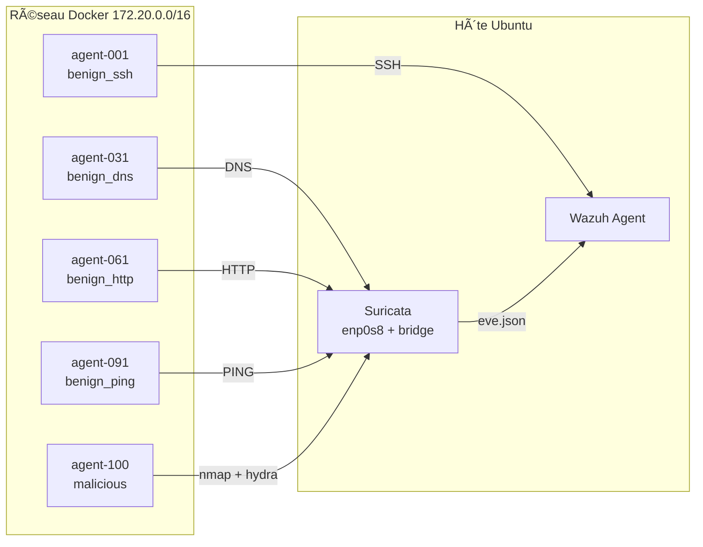
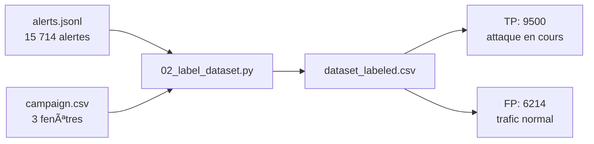
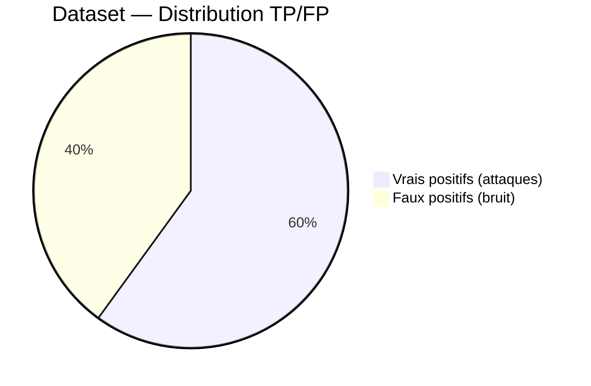

# Dataset — Obtention et labelisation

## Principe

Pour entraîner un modèle à distinguer les vrais positifs (attaques) des faux
positifs (bruit), on a besoin d'un dataset où chaque alerte est **labellisée**
correctement.

Notre approche : **générer des attaques contrôlées** dans un labo isolé, en
enregistrant précisément les fenêtres temporelles où chaque attaque a lieu.
Les alertes dans ces fenêtres = **vrais positifs**. Les alertes hors fenêtres
(ou pendant le trafic normal) = **faux positifs**.

```mermaid
gantt
    title Campagne 3 phases (40 min)
    dateFormat HH:mm
    axisFormat %H:%M
    
    section Phase 1
    Trafic bénin uniquement (FP)    :p1, 00:00, 10min
    
    section Phase 2
    Trafic bénin + Attaques (TP+FP) :p2, 10min, 20min
    
    section Phase 3
    Trafic bénin uniquement (FP)    :p3, 30min, 10min
```

## Génération du dataset

### Méthode 1 — Script campagne (ParrotOS)

Un script bash lance des attaques et du trafic normal depuis ParrotOS vers
la cible Ubuntu :

```bash
sudo bash scripts/campaign-runner.sh
```

Ce script :
1. Lance des **nmap scans** (SYN, version, OS fingerprint)
2. Lance des **hydra bruteforce** SSH
3. Mélange avec du **trafic bénin** (SSH normal, DNS, HTTP, ping)
4. Enregistre les timestamps dans `data/attack_windows/campaign_*.csv`

### Méthode 2 — Docker massive (100 conteneurs)

Pour un dataset plus réaliste avec beaucoup de bruit de fond, on lance
**100 conteneurs Docker** sur la cible :

```bash
sudo bash scripts/docker-dataset/run-campaign-v2.sh
```

| Profil | Nb | Comportement |
|--------|----|-------------|
| `benign_ssh` | 30 | Connexion SSH vers le Manager |
| `benign_dns` | 20 | Requêtes DNS vers 8.8.8.8 |
| `benign_http` | 30 | HTTP(S) vers sites réels |
| `benign_ping` | 19 | ICMP echo vers IPs variées |
| `malicious` | 1 | nmap + hydra (8 cycles) |



## Fichier de campagne (CSV)

Chaque campagne produit un fichier CSV avec les fenêtres temporelles :

```csv
attack_id,phase,start_utc,end_utc,attack_type,container_count
CAMP_V2_20260713_214200,1,2026-07-13T19:42:00Z,2026-07-13T19:52:00Z,benign_only,100
CAMP_V2_20260713_214200,2,2026-07-13T19:52:00Z,2026-07-13T20:12:00Z,malicious_attack,100
CAMP_V2_20260713_214200,3,2026-07-13T20:12:00Z,2026-07-13T20:22:00Z,benign_only,100
```

## Collecte des alertes

`01_collect_alerts.py` lit le fichier local `alerts.json` du Wazuh Manager
et le convertit en JSONL :

```bash
python3 pipeline/01_collect_alerts.py --days 1
```

```
Total: 15714, Scans: 13448
Saved: /tmp/alerts_20260713_193152.jsonl (17.6 MB)
```

## Labelisation

`02_label_dataset.py` croise les alertes avec les fenêtres du CSV :



### Règle de labelisation

| Condition | Label |
|-----------|-------|
| Alerte pendant `malicious_attack` + description contient "scan" | TP (1) |
| Alerte pendant `malicious_attack` + description **pas** "scan" | FP (0) |
| Alerte pendant `benign_only` | FP (0) |
| Alerte en dehors de toute fenêtre | FP (0) |

## Distribution attendue



Un dataset avec ~60% TP / ~40% FP est idéal pour entraîner un classifieur
binaire. Si le déséquilibre est trop fort (>90% TP), on peut sous-échantillonner
ou ajuster les poids des classes dans XGBoost (`scale_pos_weight`).
