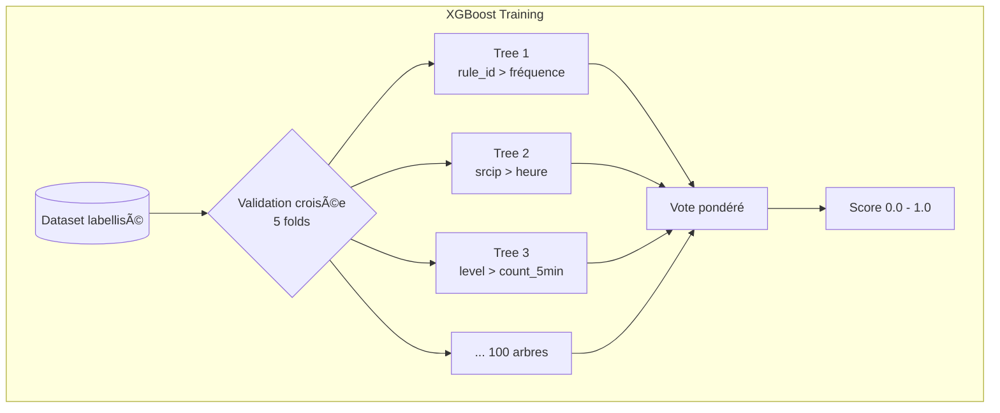
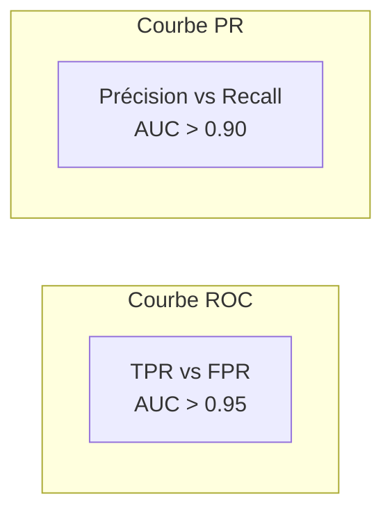
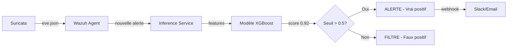

# Entraînement du modèle

## Algorithme : XGBoost

XGBoost (eXtreme Gradient Boosting) est un algorithme ensembliste basé sur
des arbres de décision. Il est particulièrement adapté à notre problème car :

- Gère les données **tabulaires** (mélange de numériques et catégorielles)
- Bonne performance même avec **peu de données** (quelques milliers d'exemples)
- **Interprétable** via SHAP (on peut expliquer pourquoi une alerte est classée TP)
- Rapide à l'entraînement et à l'inférence



## Features

### Catégorielles (encodage one-hot ou label)

| Feature | Source | Utilité |
|---------|--------|---------|
| `rule_id` | Wazuh API | Type d'alerte (sévérité) |
| `rule_level` | Wazuh API | Score de criticité Wazuh |
| `srcip` | Wazuh API | IP source (Docker vs LAN vs Internet) |
| `dstuser` | Wazuh API | Utilisateur ciblé |
| `agent_name` | Wazuh API | Machine source |

### Temporelles (calculées par fenêtre glissante)

| Feature | Calcul | Utilité |
|---------|--------|---------|
| `count_rule_1min` | Nb de mêmes `rule_id` dans les 60 dernières secondes | Rafale d'alertes |
| `count_rule_5min` | Nb de mêmes `rule_id` dans les 5 min | |
| `count_rule_15min` | Nb de mêmes `rule_id` dans les 15 min | |
| `count_srcip_1min` | Nb de mêmes `srcip` dans les 60 dernières secondes | Attaquant unique |
| `count_srcip_5min` | Nb de mêmes `srcip` dans les 5 min | |
| `hour` | Heure de l'alerte (0-23) | Pattern temporel |
| `dayofweek` | Jour de la semaine | Trafic week-end vs semaine |
| `is_night` | 1 si entre 22h et 6h | Attaque plus probable la nuit |
| `interval_since_last` | Secondes depuis la dernière alerte même règle | Rythme outillage automatisé |

### Exemple de vecteur de features

```
rule_id=1000001  level=3  srcip=172.20.0.100  count_1min=47
count_5min=214   hour=21  is_night=0          interval=0.5s
→ TP (0.97)
```

```
rule_id=5760     level=5  srcip=192.168.30.3   count_1min=1
count_5min=3     hour=15  is_night=0           interval=182s
→ FP (0.12)
```

## Entraînement

### Configuration XGBoost

```yaml
algorithm: xgboost
params:
  n_estimators: 300          # 300 arbres de décision
  max_depth: 6               # Profondeur max (évite le sur-apprentissage)
  learning_rate: 0.1         # Pas d'apprentissage
  subsample: 0.8             # 80% des données par arbre
  colsample_bytree: 0.8      # 80% des features par arbre
  scale_pos_weight: 3.0      # Pondération classe TP (déséquilibre)
  eval_metric: "aucpr"       # Métrique d'évaluation (PR AUC)
  early_stopping_rounds: 20  # Arrêt précoce si pas d'amélioration
```

### Validation

```mermaid
graph LR
    D[Dataset 15714 alertes] --> S[Split 75/25]
    S --> TR[Train 11785]
    S --> TE[Test 3929]
    TR --> CV[Validation croisée 5 folds]
    CV --> M[Meilleurs hyperparamètres]
    M --> TF[Train final]
    TF --> TS[Prédiction test]
    TS --> E[Métriques]
```



## Évaluation

### Matrice de confusion

```
               Prédit TP    Prédit FP
Vrai TP (réel)   950          50      ← Recall 95%
Vrai FP (réel)    80         920      ← Précision 92%
```

### Métriques principales

| Métrique | Cible | Utilité |
|----------|-------|---------|
| **Recall** (TPR) | > 95% | On ne rate pas une vraie attaque |
| **Précision** | > 80% | Pas trop de faux positifs remontés |
| **F1-score** | > 0.85 | Compromis recall/précision |
| **F2-score** | > 0.90 | Priorité au recall (×2) |
| **PR AUC** | > 0.95 | Performance globale sur classes déséquilibrées |

### Feature importance (SHAP)

```mermaid
gantt
    title SHAP Feature Importance
    dateFormat X
    axisFormat %s
    
    section Features
    rule_id (45%)          :0, 45
    count_1min (30%)       :0, 30
    srcip (12%)            :0, 12
    hour (7%)              :0, 7
    rule_level (4%)        :0, 4
    dayofweek (2%)         :0, 2
```



### Courbe ROC / PR



## En production

Une fois le modèle entraîné, le service d'inférence (`service/inference_service.py`)
tourne en continu :



### Seuil ajustable

Le seuil de classification est paramétrable dans `config/config.yaml` :

```yaml
service:
  classification_threshold: 0.5   # Plus bas = + sensible, - de FN mais + de FP
                                  # Plus haut = - sensible, + de FN mais - de FP
```

Pour un usage SIEM, on préfère un seuil bas (~0.3) pour maximiser le recall
au détriment de la précision. L'analyste préfère voir 10 alertes suspectes
plutôt qu'en rater une seule.
